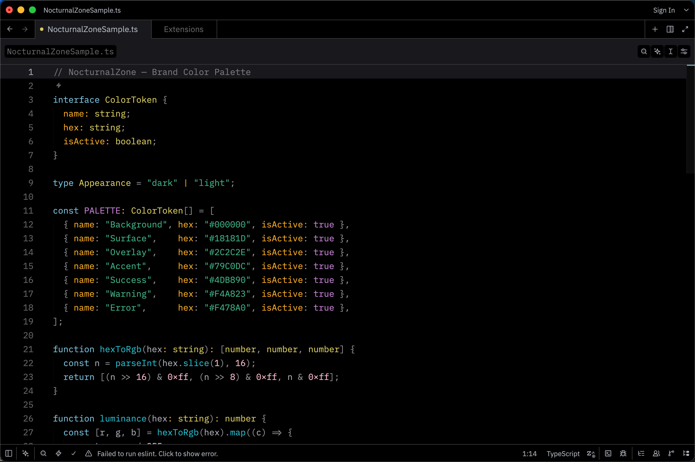

# NocturnalZone — Zed Theme

A dark editor theme for [Zed](https://zed.dev/) based on the NocturnalZone brand palette.

## Installation

### Zed Extensions

Open the command palette and run `zed: extensions`, then search for **NocturnalZone** and install it.

### Manual (development)

Clone this repository and run `zed: install dev extension` from the command palette, then select the cloned directory.

## Palette

### Base

| Role               | Hex       |
| ------------------ | --------- |
| Background         | `#000000` |
| Surface            | `#18181d` |
| Element Hover      | `#2c2c2e` |
| Border             | `#3a3a3c` |
| Text               | `#b0b4be` |
| Text Muted         | `#636366` |
| Editor FG          | `#9d9da6` |
| Line Number        | `#636366` |
| Selection          | `#2c2c2e` |
| Terminal FG        | `#9d9da6` |
| Terminal FG Bright | `#b0b4be` |
| Terminal FG Dim    | `#636366` |

### ANSI Colors

| #   | Name           | Hex       |
| --- | -------------- | --------- |
| 0   | Black          | `#18181d` |
| 1   | Red            | `#ff7a9e` |
| 2   | Green          | `#3fb085` |
| 3   | Yellow         | `#d6c95f` |
| 4   | Blue           | `#007acc` |
| 5   | Magenta        | `#c47fd4` |
| 6   | Cyan           | `#27b8c8` |
| 7   | White          | `#a9a9b3` |
| 8   | Bright Black   | `#3a3a3c` |
| 9   | Bright Red     | `#fbbccc` |
| 10  | Bright Green   | `#5cbc98` |
| 11  | Bright Yellow  | `#dcd497` |
| 12  | Bright Blue    | `#389adc` |
| 13  | Bright Magenta | `#d6b3de` |
| 14  | Bright Cyan    | `#5bd2e0` |
| 15  | Bright White   | `#b0b4be` |

### Syntax Highlights

| Token                   | Hex       | Notes  |
| ----------------------- | --------- | ------ |
| keyword                 | `#79c0dc` |        |
| tag                     | `#79c0dc` |        |
| label                   | `#79c0dc` |        |
| selector                | `#79c0dc` |        |
| punctuation.list_marker | `#79c0dc` |        |
| function                | `#27b8c8` |        |
| function.builtin        | `#27b8c8` |        |
| constructor             | `#27b8c8` |        |
| namespace               | `#27b8c8` |        |
| type                    | `#d6c95f` |        |
| enum                    | `#d6c95f` |        |
| selector.pseudo         | `#d6c95f` |        |
| string                  | `#3fb085` |        |
| text.literal            | `#3fb085` |        |
| string.escape           | `#5cbc98` |        |
| string.special          | `#5cbc98` |        |
| string.special.symbol   | `#5cbc98` |        |
| string.regex            | `#5bd2e0` |        |
| number                  | `#fbbccc` |        |
| boolean                 | `#c47fd4` |        |
| constant                | `#c47fd4` |        |
| preproc                 | `#c47fd4` |        |
| attribute               | `#c47fd4` |        |
| property                | `#f4a823` |        |
| punctuation.special     | `#f4a823` |        |
| variable                | `#a9a9b3` |        |
| variable.special        | `#b0b4be` | bold   |
| operator                | `#919198` |        |
| punctuation             | `#919198` |        |
| punctuation.bracket     | `#919198` |        |
| punctuation.delimiter   | `#919198` |        |
| punctuation.markup      | `#919198` |        |
| embedded                | `#9d9da6` |        |
| comment                 | `#787879` |        |
| comment.doc             | `#787879` |        |
| emphasis                | `#919198` | italic |
| emphasis.strong         | `#a9a9b3` | bold   |
| title                   | `#a9a9b3` | bold   |
| link_text               | `#79c0dc` |        |
| link_uri                | `#79c0dc` |        |

## License

[MIT](LICENSE)
